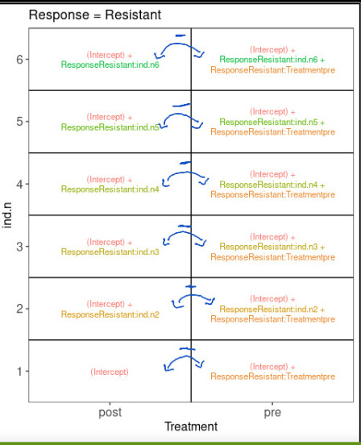

```{r setup, include=FALSE}
knitr::opts_chunk$set(echo = TRUE)
```
# Modelos estadísticos

* Revisión de regresión lineal https://lcolladotor.github.io/bioc_team_ds/helping-others.html#linear-regression-example
* Con R, usamos mucho la función `model.matrix()` y la sintáxis de fórmula `Y ~ X1 + X2` tal como en el siguiente ejemplo.

```{r model.matrix}
## ?model.matrix
mat <- with(trees, model.matrix(log(Volume) ~ log(Height) + log(Girth)))
mat
colnames(mat)
```
<span style="color:#E67E22"> Beta 1 es el cambio promedio en Y por cada incremento de una unidad en la variable x. 
Por cada incremento de 1 en el eje x aumenta el valor de Y. </span>


* ¿Cómo interpretamos los nombres de las columnas de `mat`?

```{r lm_example}
summary(lm(log(Volume) ~ log(Height) + log(Girth), data = trees))
```

<span style="color:#E67E22"> Cuando hacemos un modelo de expresión diferencial, si tenemos mil genes, vamos a hacer mil regresiones lineales. Como esto resultaría en muchas tablitas, únicamente extraeremos la información de un solo coeficiente (por ejemplo ```log Height``` en este caso).</span>  

## ExploreModelMatrix

* Es un paquete de Bioconductor que nos ayuda a entender los modelos estadísticos que estamos usando gracias a visualizaciones http://www.bioconductor.org/packages/ExploreModelMatrix/ que está descrito en el siguiente artículo
* Revisaremos los ejemplos en http://www.bioconductor.org/packages/release/bioc/vignettes/ExploreModelMatrix/inst/doc/ExploreModelMatrix.html

<span style="color:#E67E22"> Nos da una interfaz gráfica que nos ayuda a entender de mejor manera los modelos de regresión lineal.  
Modelo no full rank: Existen casos en donde no tenemos observaciones. 
La interpretación para aislar alguno de los coeficientes es "dejarlo solito". Esto lo podemos lograr restando columnas y filas de la matriz. </span>

### Ejemplo 1

```{r EMM_example1}
## Datos de ejemplo
(sampleData <- data.frame(
    genotype = rep(c("A", "B"), each = 4),
    treatment = rep(c("ctrl", "trt"), 4)
))

## Creemos las imágenes usando ExploreModelMatrix
vd <- ExploreModelMatrix::VisualizeDesign(
    sampleData = sampleData,
    designFormula = ~ genotype + treatment,
    textSizeFitted = 4
)

## Veamos las imágenes
cowplot::plot_grid(plotlist = vd$plotlist)
```

De forma interactiva podemos correr el siguiente código:

```{r EMM_example1_interactive, eval = FALSE}
## Usaremos shiny otra ves
app <- ExploreModelMatrix(
    sampleData = sampleData,
    designFormula = ~ genotype + treatment
)
if (interactive()) shiny::runApp(app)
```

<span style="color:#E67E22"> Podemos "restar cuadrantes" para quedarnos solo con los coeficientes que necesitemos para dar una interpretación.</span> 

### Ejemplo 2

http://bioconductor.org/packages/release/bioc/vignettes/ExploreModelMatrix/inst/doc/ExploreModelMatrix.html#example-2

### Ejemplo 3

http://bioconductor.org/packages/release/bioc/vignettes/ExploreModelMatrix/inst/doc/ExploreModelMatrix.html#example-3

### Ejercicio

* Interpreta `ResponseResistant.Treatmentpre` del ejercicio 2. Puede ser útil tomar un _screenshot_ (captura de pantalla) y anotarla con líneas de colores. Si haces eso, puedes incluir la imagen en tus notas.

<span style="color:#E67E22"> Podemos aislar `ResponseResistant.Treatmentpre` restando las columnas 1 y 2, pero solo en el escenario en el que la respuesta es igual a resistente.</span>



* ¿Por qué es clave el `0` al inicio de la fórmula en el ejercicio 3?
<span style="color:#E67E22"> Al añadir el cero cambia la interpretación de los batches. Si queremos incluir cada uno de los batches es necesario incluir el 0+, si quisiéramos hacerlos relativos contra el batch 1, quitamos el 0+. </span>   

### Para aprender más

_A guide to creating design matrices for gene expression experiments_:

* http://bioconductor.org/packages/release/workflows/vignettes/RNAseq123/inst/doc/designmatrices.html
* https://f1000research.com/articles/9-1444

_“Model matrix not full rank”_

* http://bioconductor.org/packages/release/bioc/vignettes/DESeq2/inst/doc/DESeq2.html#model-matrix-not-full-rank

## Datos de SRP045638

Vamos a usar datos de https://www.ncbi.nlm.nih.gov/sra/?term=SRP045638 procesados con `recount3`. Primero hay que descargar los datos con los comandos que vimos ayer.

```{r download_SRP045638}
library("recount3")

# Bajamos los datos de recount3 y hacemos un subset del estudio que nos interesa. 
human_projects <- available_projects()

rse_gene_SRP045638 <- create_rse(
    subset(
        human_projects,
        project == "SRP045638" & project_type == "data_sources"
    )
)
# Convertimos los datos crudos de recount3 en el numero de lecturas con la función compute_read_counts y los almacenamos en el assay que llamaremos counts. 
assay(rse_gene_SRP045638, "counts") <- compute_read_counts(rse_gene_SRP045638)
```

Una vez descargados y con los números de lecturas podemos usar `expand_sra_attributes()`. Sin embargo, tenemos un problema con estos datos.

```{r describe_issue}
# Checamos la información, hay muestras tienen información que otras no. 
rse_gene_SRP045638$sra.sample_attributes[1:3]
```

Vamos a intentar resolverlo eliminando información que está presente solo en ciertas muestras.

```{r solve_issue}
# Eliminamos la parte que nos da problemas.
rse_gene_SRP045638$sra.sample_attributes <- gsub("dev_stage;;Fetal\\|", "", rse_gene_SRP045638$sra.sample_attributes)
rse_gene_SRP045638$sra.sample_attributes[1:3]
```

Ahora si podemos continuar con el mismo código de ayer.

```{r attributes}
rse_gene_SRP045638 <- expand_sra_attributes(rse_gene_SRP045638)

colData(rse_gene_SRP045638)[
    ,
    grepl("^sra_attribute", colnames(colData(rse_gene_SRP045638)))
]
```

Como ahora si vamos a usar esta información para un modelo estadístico, será importante que tengamos en el formato correcto de R a la información que vamos a usar.

```{r re_cast}
## Pasar de character a nuemric o factor
rse_gene_SRP045638$sra_attribute.age <- as.numeric(rse_gene_SRP045638$sra_attribute.age)
rse_gene_SRP045638$sra_attribute.disease <- factor(rse_gene_SRP045638$sra_attribute.disease)
rse_gene_SRP045638$sra_attribute.RIN <- as.numeric(rse_gene_SRP045638$sra_attribute.RIN)
rse_gene_SRP045638$sra_attribute.sex <- factor(rse_gene_SRP045638$sra_attribute.sex)

## Resumen de las variables de interés
summary(as.data.frame(colData(rse_gene_SRP045638)[
    ,
    grepl("^sra_attribute.[age|disease|RIN|sex]", colnames(colData(rse_gene_SRP045638)))
]))
```


Ahora crearemos un par de variables para que las podamos usar en nuestro análisis.

```{r new_variables}
## Encontraremos diferencias entre muestra prenatalas vs postnatales
rse_gene_SRP045638$prenatal <- factor(ifelse(rse_gene_SRP045638$sra_attribute.age < 0, "prenatal", "postnatal"))
table(rse_gene_SRP045638$prenatal)

## http://rna.recount.bio/docs/quality-check-fields.html
rse_gene_SRP045638$assigned_gene_prop <- rse_gene_SRP045638$recount_qc.gene_fc_count_all.assigned / rse_gene_SRP045638$recount_qc.gene_fc_count_all.total
summary(rse_gene_SRP045638$assigned_gene_prop)
with(colData(rse_gene_SRP045638), plot(assigned_gene_prop, sra_attribute.RIN))

## Hm... veamos si hay una diferencia entre los grupos
with(colData(rse_gene_SRP045638), tapply(assigned_gene_prop, prenatal, summary))
```

A continuación podemos eliminar algunas muestras que consideremos de baja calidad y genes con niveles de expresión muy bajos.


```{r filter_rse}
## Guardemos nuestro objeto entero por si luego cambiamos de opinión
rse_gene_SRP045638_unfiltered <- rse_gene_SRP045638

## Eliminemos a muestras malas
hist(rse_gene_SRP045638$assigned_gene_prop)
table(rse_gene_SRP045638$assigned_gene_prop < 0.3)
rse_gene_SRP045638 <- rse_gene_SRP045638[, rse_gene_SRP045638$assigned_gene_prop > 0.3]

## Calculemos los niveles medios de expresión de los genes en nuestras
## muestras.
## Ojo: en un análisis real probablemente haríamos esto con los RPKMs o CPMs
## en vez de las cuentas.
gene_means <- rowMeans(assay(rse_gene_SRP045638, "counts"))
summary(gene_means)

## Eliminamos genes
rse_gene_SRP045638 <- rse_gene_SRP045638[gene_means > 0.1, ]

## Dimensiones finales
dim(rse_gene_SRP045638)

## Porcentaje de genes que retuvimos
round(nrow(rse_gene_SRP045638) / nrow(rse_gene_SRP045638_unfiltered) * 100, 2)
```
Ahora ya estamos listos para continuar con el análisis de expresión diferencial, bueno, casi.


## Normalización de datos

* Lean _A hypothetical scenario_ en uno de los artículos sobre `edgeR` https://genomebiology.biomedcentral.com/articles/10.1186/gb-2010-11-3-r25#Sec2 para entender un poco sobre el concepto de _composition bias_.
* Sigue siendo relevante con datos de scRNA-seq como pueden ver en http://bioconductor.org/books/3.14/OSCA.multisample/multi-sample-comparisons.html#performing-the-de-analysis. Ahí descubren una serie de pasos para usar métodos desarrollados para bulk RNA-seq y como se pueden usar en scRNA-seq.


```{r normalize}
library("edgeR") # BiocManager::install("edgeR", update = FALSE)
dge <- DGEList(
    counts = assay(rse_gene_SRP045638, "counts"),
    genes = rowData(rse_gene_SRP045638)
)
dge <- calcNormFactors(dge)
```

## Expresión diferencial

Primero que nada, definamos nuestro modelo estadístico. Típicamente, exploraríamos más los datos para revisar que no haya otros problemas con las muestras y para explorar la relación entre nuestras variables.

```{r explore_gene_prop_by_age}
library("ggplot2")
ggplot(as.data.frame(colData(rse_gene_SRP045638)), aes(y = assigned_gene_prop, x = prenatal)) +
    geom_boxplot() +
    theme_bw(base_size = 20) +
    ylab("Assigned Gene Prop") +
    xlab("Age Group")
```
Por ejemplo, usando el paquete de [`variancePartition`](https://bioconductor.org/packages/variancePartition) y [`scater`](https://bioconductor.org/packages/scater) entre otros tal como exploramos en el siguiente video del club de R de LIBD (_[notes in English](https://docs.google.com/document/d/1hil3zwPN6BW6HlwldLbM1FdlLIBWKFNXRUqJJEK_-eY/edit)_)/

<iframe width="560" height="315" src="https://www.youtube.com/embed/OdNU5LUOHng" frameborder="0" allow="accelerometer; autoplay; clipboard-write; encrypted-media; gyroscope; picture-in-picture" allowfullscreen></iframe>


Por ahora continuaremos con el siguiente modelo estadístico.

```{r statiscal_model}
mod <- model.matrix(~ prenatal + sra_attribute.RIN + sra_attribute.sex + assigned_gene_prop,
    data = colData(rse_gene_SRP045638)
)
colnames(mod)
```
<span style="color:#E67E22"> En este caso, una de las columnas se llamna "prenatalprenatal" porque tenemos una variable que se llama "prenatal" que tiene dos opciones: pre y postnatal, si las ordenamos en orden alfabético va a ir primero postnatal, entonces será el valor de referencia. Este coeficiente nos muestra la diferencia de prenatal - postnatal. Nos está mostrando el contraste, no el grupo de referencia. </span>  

Ya teniendo el modelo estadístico, podemos usar `limma` para realizar el análisis de expresión diferencial como tal.

```{r run_limma}
library("limma")
vGene <- voom(dge, mod, plot = TRUE) # Está gráfica ve la relación entre el promedio de expresión (x) y la varianza (y).

eb_results <- eBayes(lmFit(vGene))

# topTable nos sirve para escoger un coeficiente de nuestro interés. El número de columna de nuestro modelo. Los argumentos number y sort.by es necesario dejarlos siempre igual
de_results <- topTable(
    eb_results,
    coef = 2,
    number = nrow(rse_gene_SRP045638),
    sort.by = "none"
)
dim(de_results)
head(de_results)

## Genes diferencialmente expresados entre pre y post natal con FDR < 5%
table(de_results$adj.P.Val < 0.05)

## Visualicemos los resultados estadísticos
plotMA(eb_results, coef = 2)

volcanoplot(eb_results, coef = 2, highlight = 3, names = de_results$gene_name)
de_results[de_results$gene_name %in% c("ZSCAN2", "VASH2", "KIAA0922"), ]
```

* https://www.genecards.org/cgi-bin/carddisp.pl?gene=ZSCAN2
* https://www.genecards.org/cgi-bin/carddisp.pl?gene=VASH2
* https://www.genecards.org/cgi-bin/carddisp.pl?gene=KIAA0922

## Visualizando genes DE


De `vGene$E` podemos extraer los datos normalizados por `limma-voom`. Revisemos los top 50 genes diferencialmente expresados.

```{r pheatmap1}
## Extraer valores de los genes de interés
exprs_heatmap <- vGene$E[rank(de_results$adj.P.Val) <= 50, ]

## Creemos una tabla con información de las muestras
## y con nombres de columnas más amigables
df <- as.data.frame(colData(rse_gene_SRP045638)[, c("prenatal", "sra_attribute.RIN", "sra_attribute.sex")])
colnames(df) <- c("AgeGroup", "RIN", "Sex")

## Hagamos un heatmap
library("pheatmap")
pheatmap(
    exprs_heatmap,
    # Agrupar genes
    cluster_rows = TRUE,
    # Agrupar muestras
    cluster_cols = TRUE,
    show_rownames = FALSE,
    show_colnames = FALSE,
    annotation_col = df
)
```

Los resultados que tenemos no son tan sorprendentes porque hay una diferencia enorme en los perfiles de expresión en el DLPFC entre muestra pre y post-natales. Eso lo podemos ver con MDS (multidimensional scaling) tal como describen en [este workflow](http://bioconductor.org/packages/release/workflows/vignettes/RNAseq123/inst/doc/limmaWorkflow.html#unsupervised-clustering-of-samples).

```{r plot_mds}
## Para colores
library("RColorBrewer")

## Conviertiendo los grupos de edad a colores
col.group <- df$AgeGroup
levels(col.group) <- brewer.pal(nlevels(col.group), "Set1")
col.group <- as.character(col.group)

## MDS por grupos de edad
plotMDS(vGene$E, labels = df$AgeGroup, col = col.group)

## Conviertiendo los valores de Sex a colores
col.sex <- df$Sex
levels(col.sex) <- brewer.pal(nlevels(col.sex), "Dark2")
col.sex <- as.character(col.sex)

## MDS por sexo
plotMDS(vGene$E, labels = df$Sex, col = col.sex)
```

## Ejercicio

Agreguen los nombres de los genes a nuestro `pheatmap`. 

Pistas:

* Revisen la información de `rowRanges(rse_gene_SRP045638)` o `de_results`.
* Exploren que hace la función `match()`.

```{r pheatmap2}
v <-match(rownames(exprs_heatmap), de_results$gene_id)

nombres_humanos<-de_results$gene_name[v]

rownames(exprs_heatmap) <- nombres_humanos

pheatmap(exprs_heatmap, cluster_rows = TRUE, cluster_cols = TRUE, show_rownames = TRUE, show_colnames = FALSE, annotation_col = df)

```


```{r pdf}
pdf("pheatmap_con_nombres.pdf", height = 14, useDingbats = FALSE)
pheatmap(exprs_heatmap, cluster_rows = TRUE, cluster_cols = TRUE, show_rownames = TRUE, show_colnames = FALSE, annotation_col = df)

dev.off()
```
## Comunidad

Algunxs de lxs autores de `ExploreModelMatrix`:

* https://twitter.com/CSoneson
* https://twitter.com/FedeBioinfo
* https://twitter.com/mikelove

Algunxs de lxs autores de `edgeR` y `limma`:

* https://twitter.com/mritchieau
* https://twitter.com/davisjmcc
* https://twitter.com/markrobinsonca
* https://twitter.com/AliciaOshlack

